# Full Cart Store 2022 annual sales analysis

This project analyzes the 2022 sales records for Full Cart Store. It pairs an Excel workbook containing dynamic pivot tables, slicers, and an executive dashboard with a Python script that cleans raw transactions and generates charts.

## Executive dashboard

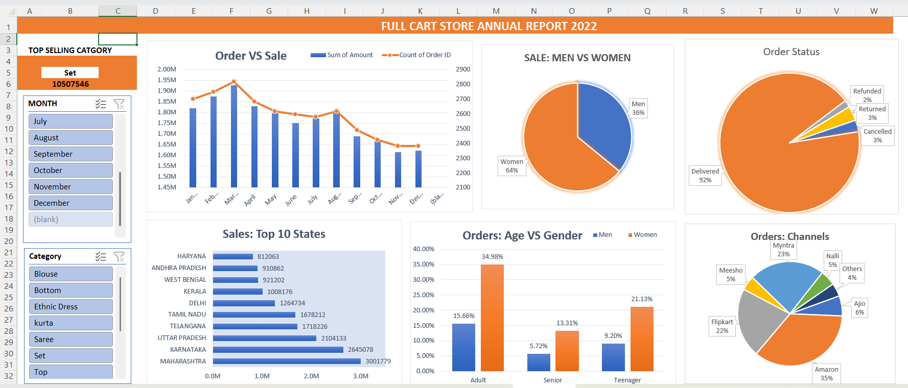

## Core sales metrics

- Top product category: Set (Total sales: Rs 10,507,546)
- Customer split by gender: Women account for 64% of sales, Men account for 36%
- Largest age group: Adult women (34.98% of total orders)
- Top state: Maharashtra (Rs 3,001,779 in sales)
- Main sales channel: Amazon (35% of total orders)
- Delivery completion: 92% delivered

## Excel pivot table summaries

### Monthly sales and order volume (Sheet: DATA ANALYSIS-PIVOT-Q1)

March recorded the highest sales and order volume of the year. Sales dipped slightly entering the final quarter.

| Month | Order count | Sales (INR) |
| :--- | :--- | :--- |
| January | 2,720 | 1,810,000 |
| February | 2,510 | 1,680,000 |
| March | 2,810 | 1,920,000 |
| April | 2,600 | 1,750,000 |
| May | 2,790 | 1,880,000 |
| June | 2,700 | 1,790,000 |
| July | 2,650 | 1,770,000 |
| August | 2,610 | 1,740,000 |
| September | 2,580 | 1,710,000 |
| October | 2,520 | 1,670,000 |
| November | 2,490 | 1,640,000 |
| December | 2,540 | 1,690,000 |

### Revenue share by gender (Sheet: DATA ANALYSIS-PIVOT-Q2)

Female buyers drove close to two-thirds of store revenue.

| Gender | Share of sales | Total revenue (approx.) |
| :--- | :--- | :--- |
| Women | 64% | Rs 13,600,000 |
| Men | 36% | Rs 7,650,000 |
| Total | 100% | Rs 21,250,000 |

### Order status and delivery fulfillment (Sheet: DATA ANALYSIS-PIVOT-Q3)

Most orders reached the customer without incident. Cancellations and returns made up a small fraction of totals.

| Status | Share of total orders |
| :--- | :--- |
| Delivered | 92% |
| Cancelled | 3% |
| Returned | 3% |
| Refunded | 2% |

### Top 10 states by sales (Sheet: DATA ANALYSIS-PIVOT-Q4)

Three states generated the majority of sales volume: Maharashtra, Karnataka, and Uttar Pradesh.

| Rank | State | Total sales (INR) |
| :--- | :--- | :--- |
| 1 | Maharashtra | 3,001,779 |
| 2 | Karnataka | 2,645,078 |
| 3 | Uttar Pradesh | 2,104,133 |
| 4 | Telangana | 1,718,226 |
| 5 | Tamil Nadu | 1,678,212 |
| 6 | Delhi | 1,264,734 |
| 7 | Kerala | 1,008,176 |
| 8 | West Bengal | 921,202 |
| 9 | Andhra Pradesh | 910,862 |
| 10 | Haryana | 812,063 |

### Orders by age group and gender (Sheet: DATA ANALYSIS-PIVOT-Q5)

Adult women placed more orders than any other group, followed by teenage women.

| Age group | Gender | Share of orders |
| :--- | :--- | :--- |
| Adult | Women | 34.98% |
| Adult | Men | 15.66% |
| Teenager | Women | 21.13% |
| Teenager | Men | 9.20% |
| Senior | Women | 13.31% |
| Senior | Men | 5.72% |

### Orders by sales channel (Sheet: DATA ANALYSIS-PIVOT-Q6)

Three marketplaces handled 80% of all orders, with Amazon leading the group.

| Channel | Share of orders |
| :--- | :--- |
| Amazon | 35% |
| Myntra | 23% |
| Flipkart | 22% |
| Ajio | 6% |
| Meesho | 5% |
| Nalli | 5% |
| Others | 4% |

## Python script execution output

Console summary generated by running the automated cleaning and calculation script:

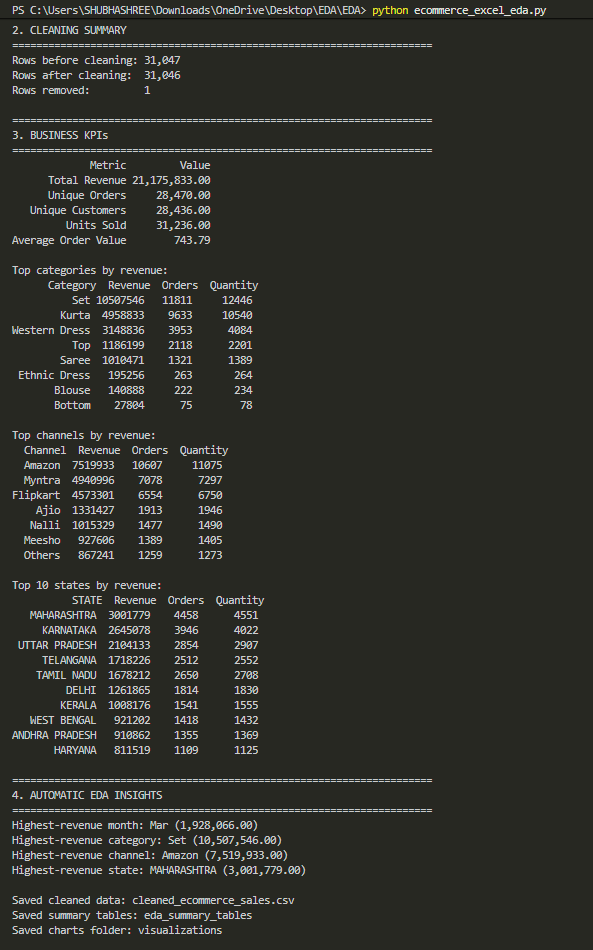

## Python visualization gallery

The script `ecommerce_excel_eda.py` generated these 12 charts directly from the transaction data.

### Monthly patterns
| Monthly revenue | Monthly order count |
| :---: | :---: |
| 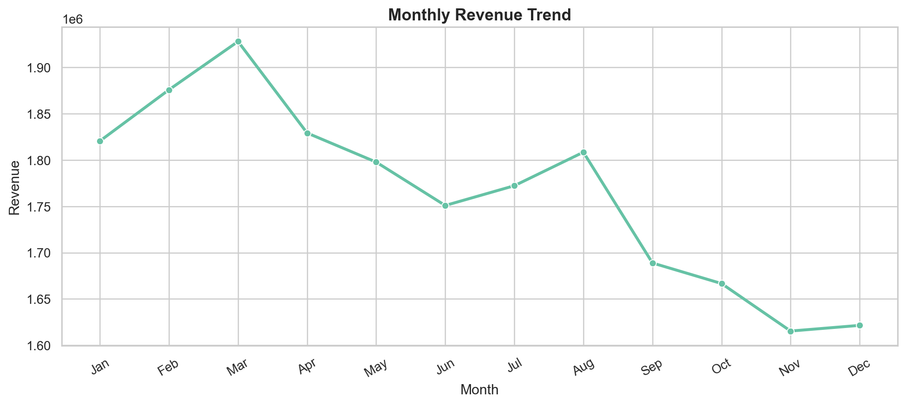 | 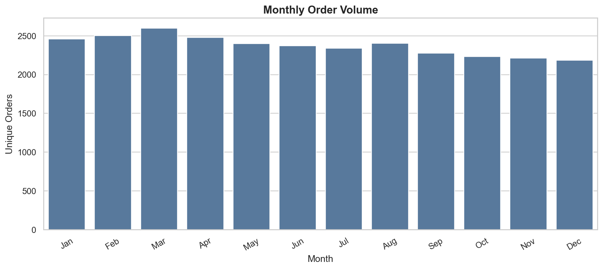 |

### Category breakdown
| Revenue by category | Pareto analysis |
| :---: | :---: |
| 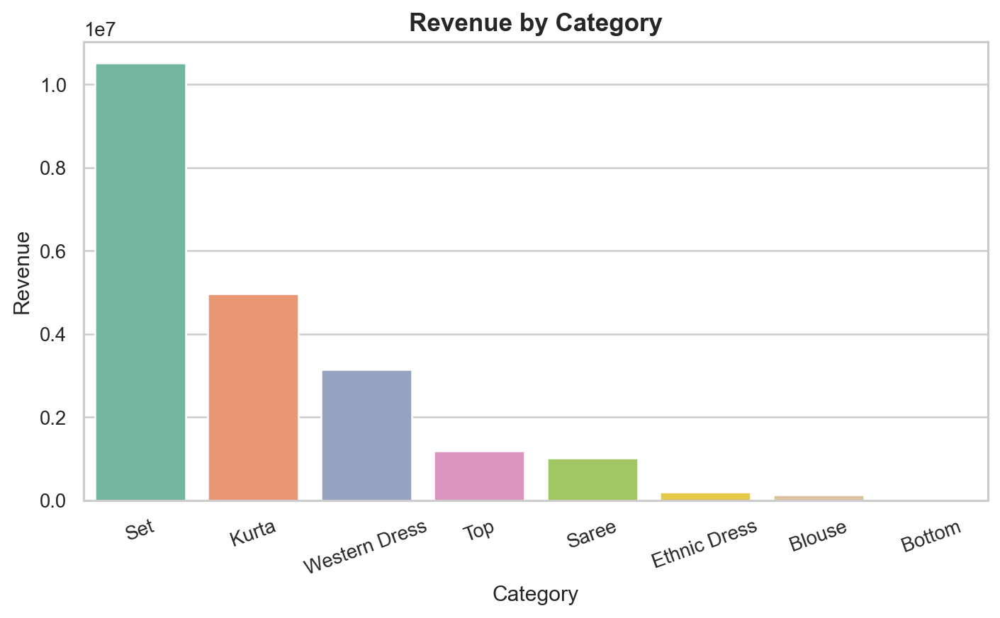 | 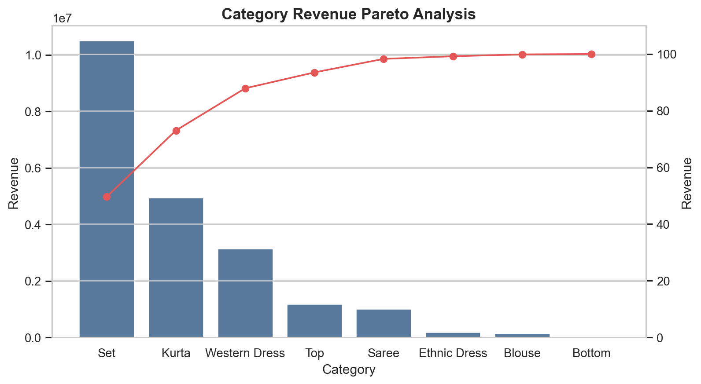 |

### Channels and fulfillment
| Channel revenue | Delivery status |
| :---: | :---: |
| 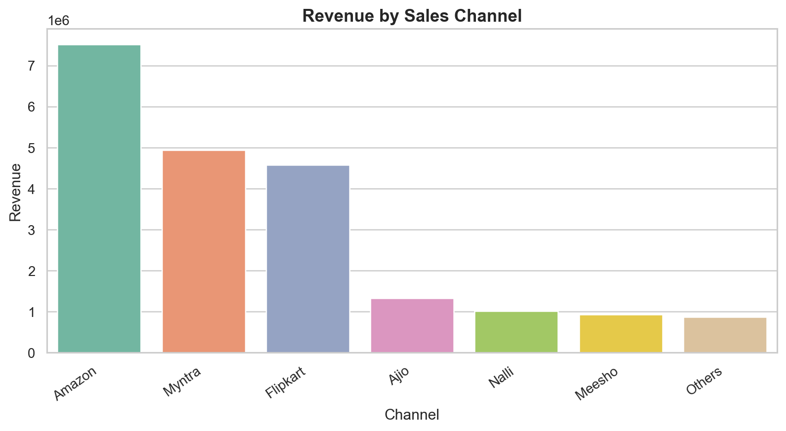 | 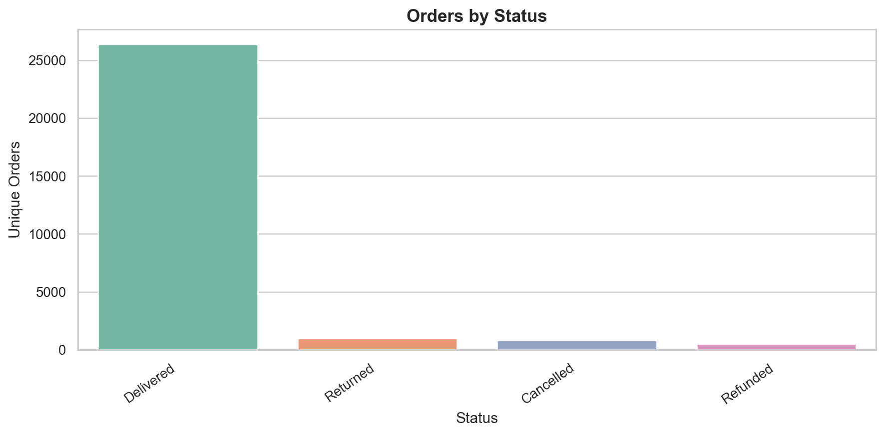 |

### Demographics and geography
| Age and gender sales | Top 10 states |
| :---: | :---: |
| 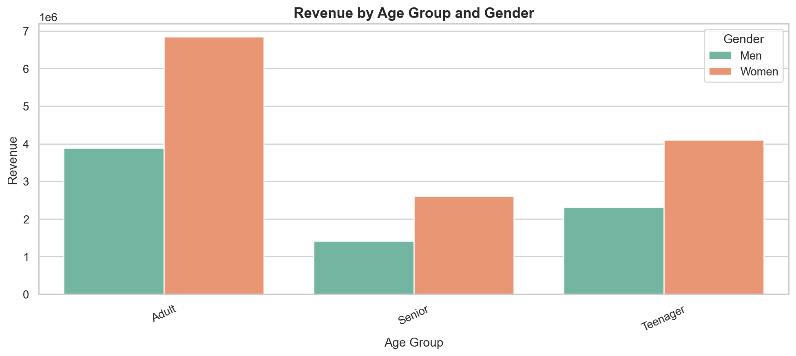 | 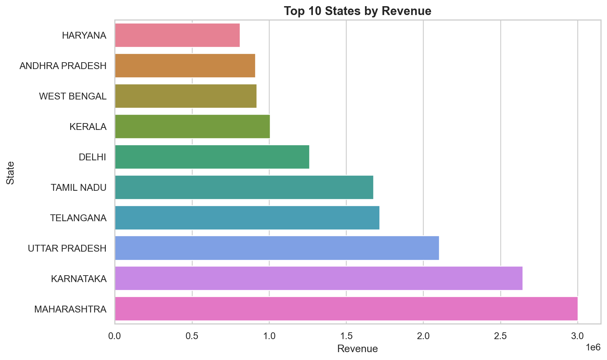 |

### Distributions and outliers
| Quantity per order | Order amount spread |
| :---: | :---: |
| 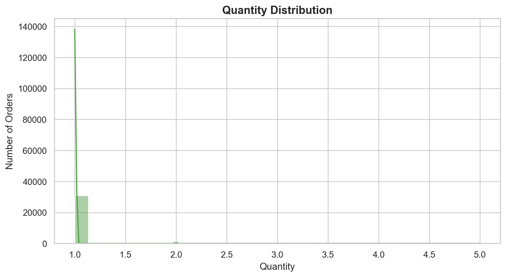 | 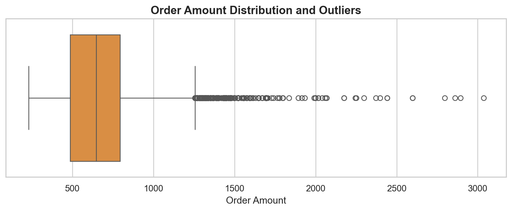 |

### Business customer split and correlations
| B2B vs retail sales | Feature correlations |
| :---: | :---: |
| 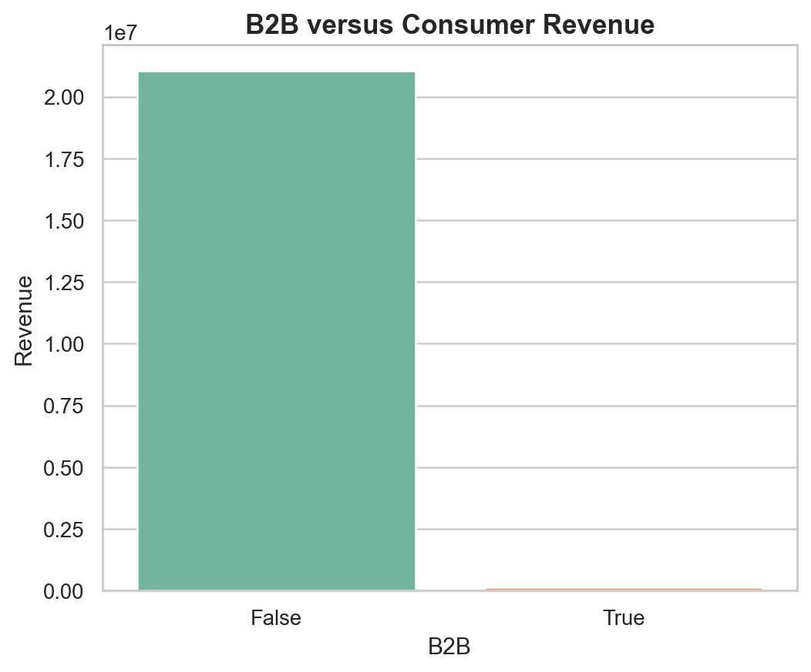 | 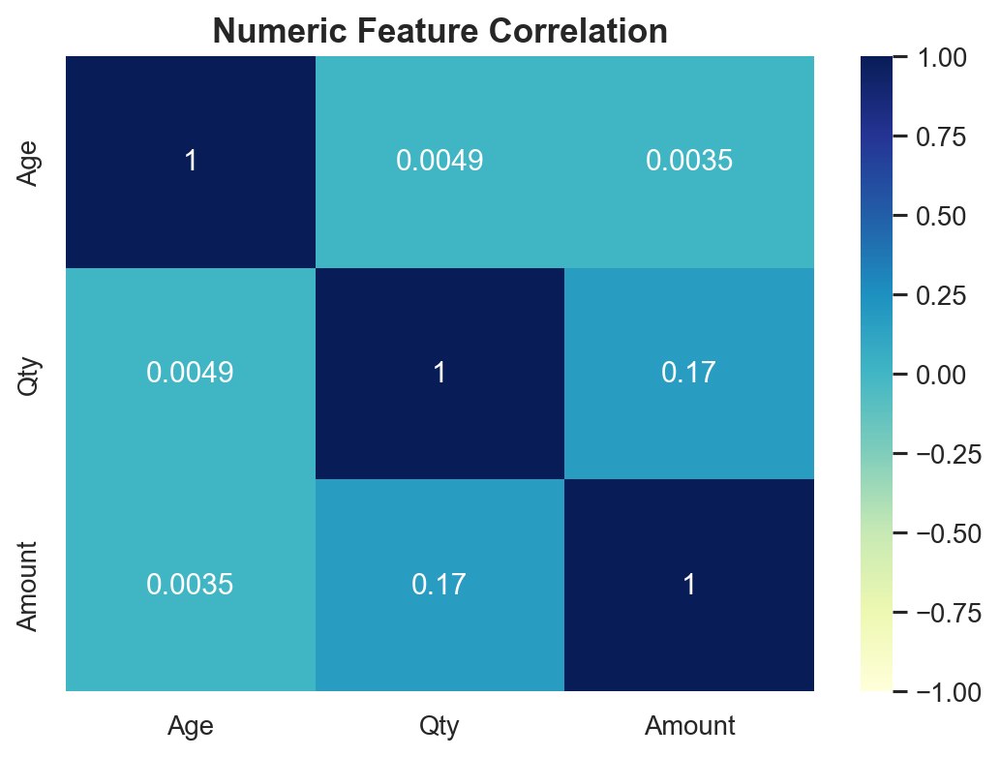 |

## Key takeaways

1. Adult women between 21 and 50 placed roughly 35% of all orders and generated the bulk of revenue. Marketing spend belongs on collections aimed at this group.
2. The Set category accounted for almost half of total annual sales (Rs 10.5M out of Rs 21.2M). Keeping adequate stock of sets should take priority over slower-moving lines like blouses or bottoms.
3. Amazon, Myntra, and Flipkart brought in 80% of all customer orders. Advertising campaigns and discounts should focus on these three channels.
4. Maharashtra, Karnataka, and Uttar Pradesh generated the highest sales volume. Local warehouse fulfillment in these states will cut down transit times and shipping expenses.

## Repository Architecture

├── EXCEL_PROJECT (1).xlsx          # Workbook with pivot tables and dashboard
├── ecommerce_excel_eda.py           # Data processing and chart generation script
├── requirements.txt                 # Python dependencies
├── dashboard.png                    # Screenshot of Excel dashboard
├── terminal_output.png              # Screenshot of console summary
├── README.md                        # Project documentation
├── cleaned_ecommerce_sales.csv      # Exported cleaned dataset
├── visualizations/                  # Exported chart images
└── eda_summary_tables/              # Exported summary tables